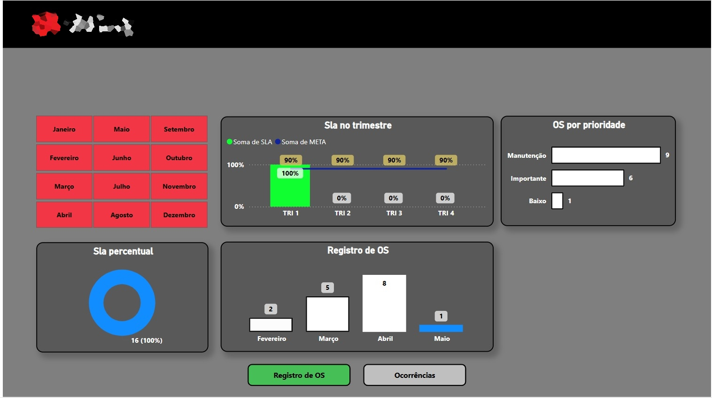

# Case: Arquitetura de BI Setorizado e Governança de Dados

## 📌 Visão Geral
Este projeto consistiu no desenvolvimento de um ecossistema completo de Inteligência de Negócios para atender mais de 25 áreas distintas de uma organização. A solução foi desenhada para eliminar o uso de planilhas descentralizadas e estabelecer uma **"Única Fonte da Verdade"**.

## 🛠️ Stack Tecnológica
* **Ingestão:** SharePoint Online e Microsoft Lists.
* **Customização:** JSON para interfaces de input.
* **Processamento (ETL):** Power Query (M Language).
* **Inteligência:** Power BI Desktop (Linguagem DAX).
* **Distribuição:** Power BI Service e Microsoft Fabric (OneLake).

* ---

## 🗺️ Fluxo de Governança e Inteligência de Negócios
*Mapeamento completo do ciclo de vida do dado: desde o levantamento de requisitos com gestores até a entrega de insights estratégicos para a alta diretoria.*

---

## 🚀 Metodologia de Implementação

### 1. Consultoria e Requisitos
O ciclo de vida inicia com o alinhamento junto a gestores e diretores para mapear KPIs vitais para as decisões estratégicas.

### 2. Engenharia de Dados e Padronização
Implementação de **Sites Gerenciais no SharePoint** com campos validados via JSON, garantindo que o dado inserido seja limpo e padronizado desde a origem.

### 3. Desenvolvimento de Inteligência
* **Extração:** Conexão automatizada via APIs e nuvem.
* **Modelagem:** Criação de medidas complexas em DAX e relacionamentos entre tabelas para garantir responsividade.

### 4. Entrega e Visualização
Criação de dashboards com foco em UX/UI (design no Canva) e publicação segura com restrições hierárquicas.

---

## 🔄 Variações e Flexibilidade Técnica
* **Fontes Heterogêneas:** Consolidação de dados de APIs REST e bancos de dados locais.
* **Segurança (RLS):** Implementação de *Row-Level Security* para que cada gestor visualize apenas os dados de sua unidade.

* ## 📸 Demonstração Visual dos Dashboards

### 1. Engenharia de Base
*Análise detalhada da infraestrutura e performance da engenharia de base, monitorando indicadores críticos para a operação.*

### 2. Gestão de Treinamentos e Cursos
*Painel focado no desenvolvimento do capital humano, acompanhando o progresso e a adesão dos funcionários aos cursos oferecidos.*

### 3. Monitoramento de Segurança
*Dashboard estratégico para controle de incidentes, níveis de conformidade e métricas de segurança patrimonial ou digital.*

## 📈 Resultados Gerados
* **Escalabilidade:** Aplicado em mais de 25 setores.
* **Agilidade:** Dados atualizados automaticamente até 8x ao dia via OneLake.
* **Cultura Data-Driven:** Transição de processos intuitivos para decisões baseadas em evidências.
